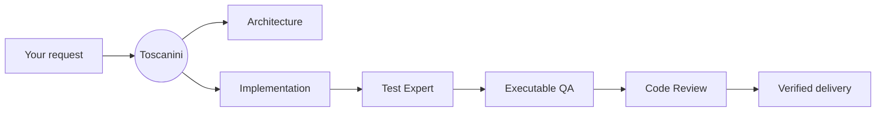

<p align="center">
  
</p>

<h1 align="center">Toscanini</h1>

<p align="center">
  A disciplined multi-agent workflow for shipping software with independent architecture, testing, QA, and code review.
</p>

<p align="center">
  <a href="LICENSE"></a>
  
</p>

> **Early release:** the installer and workflow are usable today. The command centers are still evolving, and live activity depends on tasks emitting Toscanini telemetry.

## The idea

AI coding agents are fast, but one agent should not design a change, implement it, write its tests, and approve its own work without independent checks.

Toscanini installs a persistent delivery policy into your repository. You keep speaking naturally to your coding agent; Toscanini decides which specialists are needed and makes every required gate produce evidence before the task can be called complete.



Small changes take a smaller path. Risky changes earn more architecture, design, testing, QA, and independent review. Toscanini is the conductor, not another instrument: it coordinates the coding agents you already use.

## Install

When the package is published, installation will be:

```sh
cd my-project
npx maestro-toscanini init
```

Until then, link the CLI from the local Toscanini source checkout:

```sh
git clone https://github.com/andremellow/toscanini.git
cd /path/to/toscanini
npm link

cd /path/to/my-project
toscanini init
```

The current directory is the default target. The interactive initializer inspects the repository, suggests compatible adapters, previews its changes, and asks before writing anything.

Start a new coding-agent session in the project after installation so the new repository instructions are loaded.

## Daily use

There is no separate `run` command and no Toscanini process to start. Ask your coding agent for work as usual:

```text
Implement customer invitations with expiring links.
```

```text
Fix the race condition in subscription renewal.
```

The installed `AGENTS.md` policy activates the workflow automatically. Commands from enabled tools enter the same workflow; for example, `/speckit.implement` remains governed by Toscanini when the Spec Kit adapter is enabled.

Toscanini does **not**:

- replace Codex or another coding agent;
- require you to launch orchestration manually;
- install application frameworks;
- pretend that tests passed or that an agent is active;
- overwrite locally customized managed files during updates.

## Specialists and gates

| Role | Responsibility |
| --- | --- |
| Architect | Defines boundaries, risks, data flow, and the implementation direction. |
| Worker | Implements the approved change. |
| Test Expert | Audits whether automated tests cover the real changed behavior with effective assertions. |
| QA | Exercises the running UI or API with representative data. It does not review source code. |
| Code Reviewer | Independently reviews the production diff for correctness, security, and maintainability. |

Architecture and design reviewers join when the change requires them. Reviewers receive neutral context and start without the implementation conversation, reducing confirmation bias.

During `toscanini init`, use the interactive checklist to choose the specialists installed in the repository. You can review or change that selection later:

```sh
toscanini agent list
toscanini agent select
```

Use the arrow keys to move, <kbd>Space</kbd> to toggle an agent, and <kbd>Enter</kbd> to confirm. For scripts and CI, use `agent enable <name>` or `agent disable <name>` instead.

## Adapters

The core workflow knows nothing about Laravel, Flutter, Spec Kit, or any other ecosystem. An **adapter** adds ecosystem-specific detection, instructions, files, or verification conventions without changing the core quality model.

Built-in adapters:

| Adapter | What it adds |
| --- | --- |
| `laravel` | Laravel-aware project context and optional Boost guidance. It does not install Laravel or Boost. |
| `spec-kit` | Toscanini architecture, UX, and verification templates inside an existing Spec Kit workspace. |
| `terminal-ui` | A local terminal view of configuration and emitted task activity. |

Manage adapters at any time:

```sh
toscanini adapter list
toscanini adapter add laravel
toscanini adapter add spec-kit
toscanini adapter add terminal-ui
toscanini adapter remove spec-kit
```

Use `--dry-run` to preview a change.

### What would a Flutter adapter do?

A useful Flutter adapter could:

1. detect Flutter from `pubspec.yaml`;
2. teach agents to respect the project's widget, state-management, and localization conventions;
3. discover the repository-owned verification command, such as `flutter test`;
4. add a Flutter specialist or reusable testing skill when needed;
5. teach executable QA how to launch and inspect the supported target platform.

It should not install Flutter, choose a state-management library, or change application code during setup.

See [Creating an adapter](docs/creating-an-adapter.md) for a complete example and contribution checklist.

## Optional terminal UI

```sh
toscanini adapter add terminal-ui
toscanini ui
```

The UI observes privacy-safe events written by instrumented tasks. It does not launch the AI task, read hidden reasoning, or fabricate activity. If no task has emitted events, it displays configuration only.

## Commands

| Command | Purpose |
| --- | --- |
| `toscanini init` | Inspect and configure the current repository interactively. |
| `toscanini inspect` | Show detected stack and verification information without changing files. |
| `toscanini adapter list` | Show available and enabled adapters. |
| `toscanini adapter add <name>` | Add an adapter to an existing installation. |
| `toscanini adapter remove <name>` | Remove a managed adapter safely. |
| `toscanini agent enable <name>` | Enable a specialist role. |
| `toscanini agent disable <name>` | Disable an optional specialist role. |
| `toscanini agent list` | Show every available specialist and whether it is enabled. |
| `toscanini agent select` | Change enabled specialists with an interactive checklist. |
| `toscanini ui` | Open the optional terminal command center. |
| `toscanini update --dry-run` | Preview an update and report conflicts. |
| `toscanini update` | Update managed files while preserving local customizations. |
| `toscanini doctor` | Diagnose missing or modified managed files. |

Pass `--target /local/path` only when operating on a repository other than the current directory.

## Update safely

```sh
toscanini update --dry-run
toscanini update
toscanini doctor
```

Toscanini records hashes for the files it manages. An update replaces an unchanged managed file, but reports a conflict when you have customized it. Existing project instructions and user-owned files are preserved.

## Extend Toscanini

Organization-specific agents and skills can be distributed as an extension without forking the core:

```text
security-extension/
├── toscanini-extension.json
├── agents/
│   └── security-reviewer.toml
└── skills/
    └── security-gate/
        └── SKILL.md
```

```json
{
  "name": "security-extension"
}
```

```sh
./scripts/install-project --extension ../security-extension
```

## Project documentation

- [Creating an adapter](docs/creating-an-adapter.md)
- [Agent roles](docs/agents.md)
- [Adapters and extensions](docs/adapters.md)
- [Dashboard integration](dashboard/README.md)
- [Troubleshooting](docs/troubleshooting.md)
- [Contributing](CONTRIBUTING.md)

## Open source

Toscanini is community software released under the [MIT License](LICENSE). Contributions for new ecosystems, stronger verification, specialist agents, documentation, and command-center interfaces are welcome.

## Distribution

The npm package is named `maestro-toscanini`; the installed executable remains `toscanini`:

```sh
npx maestro-toscanini init
```

After installing it in a project or globally, use the shorter executable:

```sh
npm install --save-dev maestro-toscanini
npx toscanini init
```

A Homebrew formula will follow versioned releases through the community tap:

```sh
brew install andremellow/tap/toscanini
```
